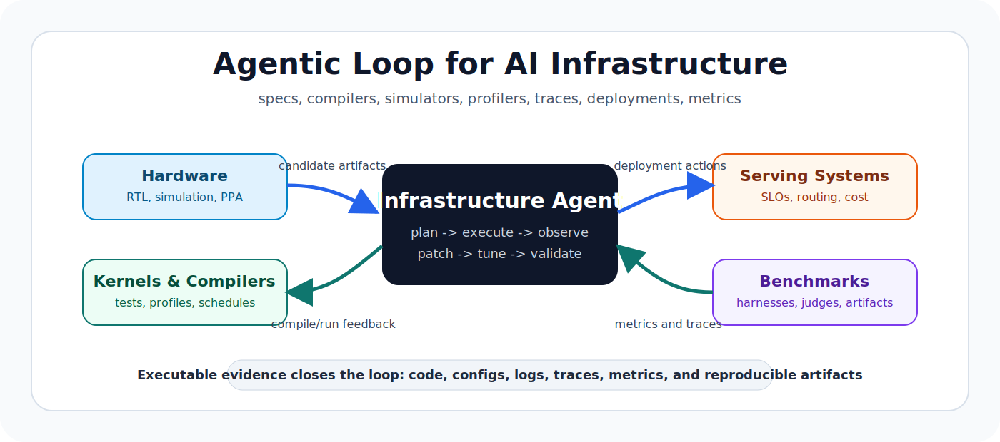

## Awesome Agent-for-Infra

> We welcome issues and pull requests for missing papers, toolchains, benchmarks, and reproducible agent workflows around AI infrastructure.

## 🎉 News

- **[2026-06-23]** Restyled the README into a survey-style Awesome list with badges, an overview map, and categorized resource tables.
- **[2026-06-18]** Released the initial four-track map for AI agents in infrastructure.

## 📖 Contents

- [Awesome Agent-for-Infra](#awesome-agent-for-infra)
- [🎉 News](#-news)
- [📖 Contents](#-contents)
- [🗺️ Overview](#overview)
- [🧭 Survey Map](#-survey-map)
- [📄 Resource List](#-resource-list)
  - [Hardware and Architecture Design](#hardware-and-architecture-design)
  - [Operators, Kernels and Compilers](#operators-kernels-and-compilers)
  - [Model Serving and System Optimization](#model-serving-and-system-optimization)
  - [Environments and Benchmarks](#environments-and-benchmarks)
- [🌟 Acknowledgment](#-acknowledgment)
- [✨ Star History](#-star-history)

## 🗺️ Overview

AI infrastructure is becoming agentic. The important systems are no longer just models that answer questions; they are agents that read specs, call compilers, run simulators, inspect profiler traces, patch code, tune deployments, and close the loop with executable evidence.

We organize the survey into four infrastructure layers:

1. <u>Hardware and Architecture Design:</u> agents that generate RTL, debug waveforms, run synthesis, and search architecture design spaces.
2. <u>Operators, Kernels and Compilers:</u> agents that generate, repair, profile, and optimize kernels, tensor programs, and compiler passes.
3. <u>Model Serving and System Optimization:</u> agents that tune serving engines, schedulers, routing, autoscaling, and deployment settings.
4. <u>Environments and Benchmarks:</u> executable harnesses and metrics for judging whether infra agents create real improvements.

## 🧭 Survey Map

| Track | Core Problem | Details |
|:-:|:-|:-:|
| Hardware and Architecture Design | Can agents turn design intent into verified and optimized hardware artifacts under simulator, synthesis, and PPA feedback? |  |
| Operators, Kernels and Compilers | Can agents generate, repair, and optimize kernels or compiler transformations using compile errors, tests, profiler traces, and hardware feedback? |  |
| Model Serving and System Optimization | Can agents tune serving engines, schedulers, deployments, and runtime configs to satisfy latency, throughput, reliability, and cost goals? |  |
| Environments and Benchmarks | How should infra agents be evaluated with executable tasks, stable harnesses, reproducible metrics, and auditable baselines? |  |

## 📄 Resource List

### Hardware and Architecture Design

| Date | Name | Title | Paper / Docs | Github |
|:-:|:-:|:-|:-:|:-:|
| 2025-03 | `OpenLLM-RTL` | Open RTL generation and verification evaluation with RTLLM 2.0, AssertEval, and RTLCoder data |  | - |
| 2024-01 | `LLM4EDA` | A taxonomy for LLMs across HDL generation, EDA scripts, verification, and physical-design workflows |  | - |
| 2023-11 | `ChipNeMo` | Domain-adapted LLMs for industrial chip design workflows |  | - |
| 2023-08 | `RTLLM` | RTL generation benchmark with syntax, functionality, and design-quality goals |  | - |
| - | `VerilogEval` | HDL generation benchmark and harness for test-driven correctness | - |  |
| - | `OpenROAD` | Open RTL-to-GDS flow for measurable physical-design feedback | - |  |
| - | `ArchGym` | Gym-style environment for architecture design-space exploration | - |  |

### Operators, Kernels and Compilers

| Date | Name | Title | Paper / Docs | Github |
|:-:|:-:|:-|:-:|:-:|
| 2026-05 | `KernelBench-X` | Category-aware benchmark for LLM-generated GPU kernels across task types and hardware behavior |  | - |
| 2026-03 | `KernelFoundry` | Hardware-aware evolutionary kernel optimization with distributed benchmarking |  | - |
| 2026-03 | `KernelSkill` | Multi-agent kernel optimization with reusable expert skills and trajectory memory |  | - |
| 2025-02 | `KernelBench` | Evaluates whether LLMs can write correct and faster GPU kernels for PyTorch workloads |  | - |
| 2023-06 | `AlphaDev` | AI-discovered sorting algorithms, a precedent for agentic low-level optimization |  | - |
| 2022-10 | `AlphaTensor` | Reinforcement learning for discovering matrix multiplication algorithms |  | - |
| 2020-06 | `Ansor` | Search-based auto-scheduler for tensor programs |  | - |
| - | `Triton` | Python-like DSL and compiler for writing efficient GPU kernels |  |  |
| - | `Apache TVM` | Tensor compiler stack with auto-scheduling and hardware-aware optimization workflows |  |  |
| - | `CUTLASS` | CUDA templates and primitives for high-performance GEMM and related kernels |  |  |

### Model Serving and System Optimization

| Date | Name | Title | Paper / Docs | Github |
|:-:|:-:|:-|:-:|:-:|
| 2024-03 | `Sarathi-Serve` | Chunked prefill and stall-free scheduling for throughput-latency tradeoffs |  |  |
| 2023-12 | `SGLang` | Structured language model programs with runtime optimizations such as KV-cache reuse |  |  |
| 2023-09 | `vLLM` | High-throughput LLM serving with KV-cache paging and continuous batching |  |  |
| - | `TensorRT-LLM` | NVIDIA inference stack for optimized LLM deployment |  |  |
| - | `TGI` | Hugging Face serving stack for text generation workloads |  |  |
| - | `llama.cpp` | Portable inference runtime with CPU, quantization, and edge-deployment relevance | - |  |
| - | `KServe` | Kubernetes-native model serving and inference platform |  |  |

### Environments and Benchmarks

| Date | Name | Title | Paper / Docs | Github |
|:-:|:-:|:-|:-:|:-:|
| 2025-02 | `KernelBench` | GPU kernel generation benchmark with correctness and speed metrics |  | - |
| 2019-11 | `MLPerf Inference` | Industry-standard inference benchmarking methodology and reference workloads |  |  |
| - | `SWE-bench` | Repo-level execution and patch-evaluation design for software agents |  |  |
| - | `LLMPerf` | LLM serving benchmark harness for latency and throughput workloads | - |  |
| - | `Triton Perf Analyzer` | Performance measurement tooling for inference deployments |  |  |
| - | `OpenAI Evals` | Evaluation framework useful for wrapping agent tasks and judges | - |  |
| - | `Inspect` | Evaluation framework for agentic and tool-using model assessments |  |  |

## 🌟 Acknowledgment

This survey is built from the open papers, benchmarks, and systems maintained by the AI infrastructure community. The README structure draws inspiration from [TsinghuaC3I/Awesome-RL-for-LRMs](https://github.com/TsinghuaC3I/Awesome-RL-for-LRMs).

## ✨ Star History

